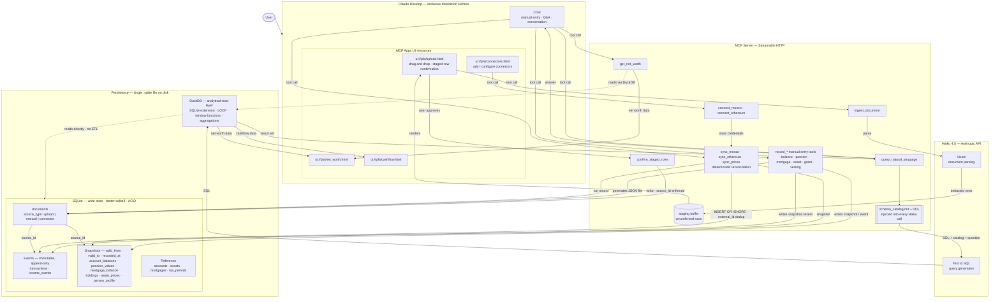

# Architecture — Personal Finance App

**Status:** Live. Describes the deployed system; the target it converges on is [end-state-flows.md](end-state-flows.md), and the rationale for how it got here is [decision-log.md](decision-log.md).

---

## What this is

A local-first, AI-native personal finance app for a single user (UK tax context). Three capabilities:

1. **Net worth** — accounts, assets, mortgages, pensions; point-in-time and trended.
2. **Cashflow and budgeting** — PAYE, NI, pension contributions, ISA allowances.
3. **Insight and Q&A** — natural language queries answered from real data.

**The app is an MCP server over Streamable HTTP.** Claude Desktop is the primary harness: it provides chat, tool orchestration, and renders interactive UI resources (`ui://`) in sandboxed iframes via the MCP Apps extension; a co-located Desktop connects to the open loopback listener through the `mcp-remote` stdio-to-HTTP bridge (it does not reliably accept a raw `url` entry). The server runs always-on on a Mac mini and is internet-reachable through ngrok behind passkey auth — see Remote hosting, authentication, and operations below. All data stays on disk.

---

## Interaction model

**Claude Desktop is the exclusive user interface.** The user never interacts with the MCP server directly, never edits a config file to add a connector, and never runs a CLI tool. Every interaction — uploading a document, adding an API key, entering a value manually, asking a question — flows through Claude Desktop.

Three modes:

**Conversation (chat)** — The default mode. The user types in Claude Desktop's chat interface. Claude invokes tools directly from the conversation: "My pension pot is £42,000 as of today's statement" calls `record_pension_value`. "What's my net worth?" calls `query_natural_language`. No form required.

**UI resources** — For interactions that benefit from dedicated UI. Rendered as sandboxed iframes via MCP Apps:

| Resource | Purpose |
|---|---|
| `ui://pfa/upload.html` | Drag and drop documents (PDFs, screenshots). Renders staged rows for confirm-or-reject before they write to the store. |
| `ui://pfa/connectors.html` | Add and configure connectors (Monzo, Ethereum wallet). Handles credential entry and discovery. |
| `ui://pfa/net_worth.html` | Net worth dashboard — trended, point-in-time, goals briefing. |
| `ui://pfa/cashflow.html` | Cashflow and budget dashboard with the gross-to-net waterfall. |

Presentation across these surfaces follows a single design language — "Instrument": a warm, scientific readout in a token-backed CSS system with self-hosted fonts and shared React primitives, full light and dark. See [docs/design-language.md](design-language.md); the system lives in `server/ui/styles/` and `server/ui/components.tsx`. The screens are responsive down to ~320px iframes (Claude mobile app, narrow desktop side panels): grids collapse at 460px (`base.css`), and every narrow-frame rule lives in one `@media (max-width: 420px)` block plus one `(pointer: coarse)` block in `server/ui/styles/narrow.css`. `npm run preview:widgets` serves all four screens at six widths against typed fixtures (`server/preview/`) for visual checks without an MCP host.

**Connector sync** — Connectors (Monzo, Ethereum wallet) sync via manually-invoked tools (`sync_monzo`, `sync_ethereum`, `sync_prices`) inside the server process, preserving the single-writer invariant. Setup — credentials, asset selection — happens through `ui://pfa/connectors.html`. Scheduled background sync (launchd/cron) is deferred.

---

## Tech stack

| Component | Technology | Why |
|---|---|---|
| MCP server | Node.js + `@modelcontextprotocol/sdk` | Matches the ext-apps reference implementation; Streamable HTTP transport on localhost; Desktop bridges in via `mcp-remote` |
| Write store | SQLite via `better-sqlite3` | Local-first, ACID, single file, zero ops. The only sensible choice. |
| Analytical read | DuckDB via `duckdb` npm + SQLite extension | Reads the `.sqlite` file directly — no ETL, no sync. Columnar execution for window functions and complex joins. |
| Document parsing | Haiku 4.5 (vision) | Fast, cheap, accurate enough on payslips and statements at ~£0.005–0.01/page. |
| Natural language queries | Haiku 4.5 (text-to-SQL) | Generates SQL from natural language against schema catalog + DDL. DuckDB executes it. |
| UI resources | MCP Apps (`ui://` resources) | Rendered in Claude Desktop's sandboxed iframe. No separate frontend. |
| Connectors | Manually-invoked sync tools in-process | Single-writer invariant (no multi-process SQLite contention); re-auth failures surface as a visible re-connect, not a silent stall. Scheduling deferred. |

---

## Architecture diagram



---

## Persistence layer

### Two table patterns

Every table is one of two patterns. Mixing them is a design error.

#### Event tables — immutable, append-only

Things that happened. Financial columns are never updated or deleted. The sole permitted mutation is the `superseded_by` correction marker (see the Edit flow): a wrong or removed row keeps every financial value intact and is excluded from reads, never overwritten.

```sql
occurred_at        TIMESTAMP NOT NULL
recorded_at        TIMESTAMP NOT NULL
source_id          INTEGER NOT NULL REFERENCES documents(id)
external_id        TEXT
```

#### Snapshot tables — temporal observations

Observed values that change over time. Gaps filled at query time via LOCF.

```sql
valid_from         DATE NOT NULL
valid_to           DATE
recorded_at        TIMESTAMP NOT NULL
source_id          INTEGER NOT NULL REFERENCES documents(id)
```

A new observation (the value changed) is a new row with a later `valid_from`; the old row stays valid for its own window. A correction (the row was recorded wrong) inserts a superseding row at the original `valid_from` and sets `superseded_by` on the wrong row. Reads filter `superseded_by IS NULL`, so the superseded row leaves current truth but is preserved — the full history is always recoverable.

#### Flex layer — optional `payload` column

Some tables carry a long tail of attributes that vary per source and resist typing. These get a nullable `payload` JSON column (stored as JSON text, readable by DuckDB) for the unmodelled remainder. The payload is an optional column orthogonal to the event/snapshot/reference patterns — it is not a third pattern. It is added to a table only when that table has a demonstrated long tail, never as a blanket field. Its use is bounded by design rule 7.

### Table taxonomy

| Table | Pattern | What it holds |
|---|---|---|
| `documents` | Reference | Source anchor for every ingested row — file, manual JSON, connector run |
| `transactions` | Event | Every cash movement; linked to account |
| `income_events` | Event | Per-payslip: gross, net, PAYE, NI, pension contribution, employer contribution; variable line items in `payload` |
| `equity_vesting_event` | Event | A vesting tranche — vest date, units, market-at-vest price (event-locked tax fact), estimated value; scheme-specific detail in `payload` |
| `asset_prices` | Event (price tick) | Per-unit price for an asset at a point in time; source-tagged for future connector attribution |
| `account_balances` | Snapshot | Current account, savings balances at observation time |
| `pension_values` | Snapshot | Pot value at statement date |
| `mortgage_balance` | Snapshot | Outstanding balance and current interest rate; no property value (tracked separately via `asset_prices`) |
| `holdings` | Snapshot | Quantity of an asset held — inventory without valuation |
| `person_profile` | Snapshot | Salary, tax code, employer — valid_from/valid_to tracks changes |
| `accounts` | Reference | Account definitions (bank, type, ISA subtype, currency) |
| `assets` | Reference | Asset definitions (name, type, base currency, price_source strategy hint) |
| `mortgages` | Reference | Mortgage definitions (lender, property, original amount) |
| `equity_grant` | Reference | Equity award definition — scheme type, units, strike (event-locked), asset_id link to underlying share, vest schedule; variable terms in `payload` |
| `tax_periods` | Reference | UK tax years — `starts_on` (April 6), `ends_on` (April 5) |

### Three-layer pricing model

Asset pricing separates three concepts that change at different cadences:

| Layer | Table | Cadence | Immutable? |
|---|---|---|---|
| Inventory | `holdings` | Changes on transactions (buy, sell, vest) | No — new row when quantity changes |
| Valuation | `asset_prices` | Changes with the market; source-tagged for future connectors | Append-only — add a new row per tick |
| Event-locked prices | `equity_grant.strike_pence`, `equity_vesting_event.market_price_pence` | Set once at the event; tax fact, never refreshed | Yes |

This means refreshing a price (new `asset_prices` row) never touches holdings or event rows. The `assets.price_source` column is a strategy hint (`manual`, future `coingecko`, `zoopla`) for how to dispatch a price refresh without a schema change.

### Design rules

These are invariants. They hold across all tables, all ingestion types, all stages.

1. **`source_id` is non-negotiable.** Every event and snapshot row carries a FK to `documents`. A row with no source is a schema violation, not a warning. Enforced as a `NOT NULL` constraint, not application logic.

2. **Amounts are integers, currency is explicit.** `amount_pence INTEGER NOT NULL`. Never `REAL`. Every monetary column specifies its unit in the name. Every table with monetary data has `currency TEXT NOT NULL DEFAULT 'GBP'`. Asset prices store `unit_price_pence` in the asset's native currency alongside the `currency` field — FX conversion is a separate concern, not bundled into the price row.

3. **UK tax year is explicit.** The `tax_periods` table is the single source of truth for April 6 → April 5 boundaries. All ISA and PAYE queries anchor to this table. The schema catalog documents this so Haiku never assumes calendar year.

4. **Snapshot staleness is always surfaced.** Every query over snapshot data returns `recorded_at` alongside the value. The UI displays it. "Your pension is £42,000" without a date is a misleading statement.

5. **As-of lookup is a single query contract.** The value for a snapshot at any query date is the most recent observation whose validity range covers it — `valid_from <= as_of AND (valid_to IS NULL OR valid_to > as_of)`, taking the latest `valid_from` per series (`DISTINCT ON (series) ... ORDER BY series, valid_from DESC`). This last-observation-carried-forward (LOCF) semantic lives in one centralised helper (`server/core/snapshots.ts`), composed by every line query and by the trend points. The application never interpolates or estimates. Unknown = last observed; null = never tracked, distinguished from zero.

6. **`external_id` on event rows.** Required for connector-ingested events. Inserts from connectors use `INSERT OR IGNORE` — deduplication is guaranteed at the database level, not application logic.

7. **The flex layer is bounded.** A nullable `payload` JSON column holds the long tail of attributes that vary per source and resist typing. It is governed strictly:
   - Anything aggregated or trended stays in the typed spine — money, dates, currency, counts are never in `payload`. The payload holds descriptive attributes reasoned over qualitatively, never arithmetic.
   - Provenance never moves into `payload`. `source_id`, `recorded_at`, `valid_from` stay typed.
   - The payload is not a primary text-to-SQL target. The schema catalog documents that a table has a payload and what kind of thing it holds — it does not expose payload keys for querying. Payload surfaces in the UI and Claude's reasoning layer.
   - Promotion path: a payload attribute that becomes a recurring query target graduates to a typed spine column. This keeps the spine honest and the catalog bounded.
   - Payload is parser-structured output (typed primitives extracted first, remainder to payload), not free-form user input.
   - Added per table only on demonstrated need. Initially: `income_events`, `equity_grant`, `equity_vesting_event`. Pure-value tables (`account_balances`, `pension_values`, `mortgage_balance`) stay spine-only.

---

## Goal framework

A financial adviser starts from goals, not balances. Goal capture is therefore a first-class flow, elicited before or alongside data. This section defines how a fuzzy spoken goal becomes a set of deterministic, data-bound observations without a high-capability model inventing the financial logic.

### The dividing line

The separation that matters is grounded observation versus synthesised advice — not low-capability model versus high-capability model. Anything that must be correct and auditable is deterministic and owned by the app. Framing, prioritisation, and tradeoff reasoning are owned by the harness. The internal Haiku model stays at the I/O boundary.

| Layer | Owns |
|---|---|
| App — facts (deterministic) | Current truth, coverage, the goal catalog, goal decomposition, metric definitions, the directive engine, and cross-goal contention. |
| App — conditional engine (deterministic) | Conditional truth: the same metric and directive code evaluated against the real data plus a hypothetical overlay. Recomputes the consequence of a hypothesis; never invents the hypothesis. |
| Harness (Sonnet and above) | Conversation, prioritisation, tradeoff reasoning, challenge. Composes the hypothesis (the overlay delta); turns fired directives into advice. |
| Internal Haiku | The I/O boundary only — vision extraction, text-to-SQL, and classifying free text onto a goal type. |

A hypothetical is the real balance sheet plus a delta. The harness composes the delta — unbounded, creative — and the app recomputes consequences over the real balances, which is the one thing the harness must never do by hand (the re-ground rule). The overlay vocabulary is rows the schema already holds (a balance snapshot, a transaction), not an authored catalog of scenario types, so a hypothesis is expressible exactly when it is expressible as those rows; structural hypotheticals outside that vocabulary (a rate change, a scheme change) are left to harness reasoning and flagged as assumption-based.

### Vocabulary

These four terms are disjoint and must stay so.

- **Goal type** — a member of a finite, authored catalog (`fire`, `house_deposit`, ...). What the user wants, normalised.
- **Sub-goal** — a component a goal type deterministically decomposes into.
- **Metric** — a deterministic computation that binds a sub-goal to stored data. Its value may be null when the data does not exist yet.
- **Directive** — a rule that fires when a metric is evaluated against a sub-goal's target ("ISA 60 percent funded, 47 days left").

A goal is intent; a directive is observation. They sit on opposite sides of the grounded-observation line. The catalog of goal types and their decompositions is the authored domain corpus — see `docs/goal-catalog.md`.

Worked example: `fire` (financial independence, retire early) decomposes into `target_number` (target portfolio = annual spend / safe-withdrawal-rate), `bridge_fund` (spending across the years between retiring early and pension access age), and `contribution_gap` (required monthly contribution versus actual). The non-trivial edge is UK pension access age (57 from 2028): retiring before it silently requires an ISA or GIA bridge fund, which the decomposition encodes as a sub-goal.

### The goal pipeline

1. **Classify.** The harness elicits the goal; Haiku maps the user's words onto a goal type from the catalog. Text that maps to nothing is pushed back for clarification — an unmappable goal is inert, since it can attach to no directive.
2. **Needs spec.** For a compound goal type the app returns a structured needs spec: the slots that must be filled before decomposition (for `fire`: target annual spend, safe-withdrawal-rate, current age, target retirement age), each with a default where one is sensible.
3. **Interview.** The harness conducts the follow-up conversation to fill the slots. It is filling deterministic slots the app demanded, not deciding what the goal requires.
4. **Confirm and decompose.** On confirmation the app deterministically decomposes the goal type into its sub-goals, each bound to a metric, and stores the goal with its verbatim utterance.

### Design rules

These are invariants, in the same spirit as the persistence-layer rules.

1. **Decomposition is authored, never generated.** The financial logic that turns a goal type into sub-goals is frozen domain knowledge — identical every run and auditable. No model, Haiku or harness, generates it. A goal that cannot be decomposed deterministically is a signal to author a new goal type, not to invoke a model at runtime.

2. **Metrics bind to definitions, not rows; absence is first-class.** A goal binds to a metric definition that always resolves, even when its current value is null because no data has been captured. An unresolved metric fires a data-gap directive ("house deposit goal set, no savings account linked") which becomes the next capture prompt. Missing data is an observation, not an error.

3. **The briefing is push, not pull.** The app proactively evaluates every directive against current data and goals and hands the harness the complete observation set. The harness never chooses what to query — coverage is the app's responsibility, framing is the harness's. This is what prevents a missed pension gap because the model did not think to look.

4. **The verbatim utterance is provenance.** The user's original words are stored on the goal alongside the structured form, mirroring the source-document rule (persistence design rule 1). It serves audit — "why does this goal exist?" — and gives the harness framing context the catalog discards. It is context, never a data source; directives never fire off prose.

5. **The advice gate holds.** A directive firing is an observation and is permitted today. Ranking options ("overpay versus invest") is advice and stays gated under the observations-only decision. The goal framework sharpens where that line sits; it does not move it.

6. **Domain rule data is app-owned, dated, status-tagged, injected, and never recalled.** UK tax and legal rules that drive directives and advice live in the app as reference data, not in the model's memory. They are injected into the advice and briefing payload for the tax year in scope, the same way `schema_catalog.md` is injected into every text-to-SQL call. The harness applies and frames the rules; it never sources a tax figure from its own training, which is stale and unprovenanced. Market and macro context — "markets are down, buy now" — is the opposite category: a judgment about live external state and a form of market timing. It is out of scope, not reference data.

### Domain rule data (tax constants)

Tax and legal constants — allowances, rates, bands, the pension access age — are the sibling of `tax_periods` (persistence design rule 3): app-owned reference data, dated and provenanced. Conceptually a `tax_constants` row carries the constant key, its value (in pence with explicit currency where monetary), a `valid_from`/`valid_to` effective window (the snapshot pattern), a `status` of `enacted` or `announced`, and a source. No DDL yet.

Two properties make it carry forward-looking rule changes without new machinery:

- **Temporal versioning.** Each constant has an effective window. This year's ISA allowance is not next year's; both are rows. An announced-but-future change is simply a row whose `valid_from` is in the future — there is no separate notion of an "announcement".
- **Status.** A constant is `enacted` (in force, royal assent) or `announced` (Budget speech, draft legislation, consultation — subject to change). The status rides through to any directive built on it.

This lets the briefing fire **deadline directives** from pending constants: "ISA allowance drops to X on [date], 73 days away; current headroom Y." That is the same shape as the existing "ISA 60 percent funded, 47 days left" directive — a grounded observation, not a new mechanism. A directive resting on an `announced` (not yet `enacted`) constant must say so — "proposed, subject to legislation" — never stated as settled fact. The "act now" conclusion remains advice, behind the gate.

Updates are **human-curated**. Legislation is never auto-parsed into the canonical table — these are the most safety-critical rows in the system, and one wrong constant poisons every downstream directive. Drafting may be assisted, but a human confirms before the write, the same mandatory-review spine as document ingestion. The table therefore carries a standing maintenance obligation: curated updates on the fiscal cadence, including announced-but-pending changes.

---

## Ingestion pipeline

Three source types. The table taxonomy is identical for all three. The pipeline differs.

### Upload (low trust)

PDF, screenshot, or any document the user drops.

```
Upload → ingest_document tool → Haiku vision → extracted rows → staging buffer
→ ui://review (user confirms) → confirm_staged_rows tool → write to SQLite
```

- `documents.source_type = 'upload'`
- Human confirmation is **mandatory**. Haiku can misparse. The staging/review step is non-negotiable.
- The `documents` row stores the file path, content hash, and ingestion timestamp.

### Manual entry (medium trust)

Values the user types directly into chat. Manual entry is fanned out across one tool per series rather than a single dispatching tool — the LLM picks the right one from the conversation. Each tool ensures its reference row (account/asset/mortgage/grant), writes the audit JSON document, and writes the typed snapshot or event row in one transaction.

| Tool | Writes to |
|---|---|
| `record_account_balance` | `account_balances` (creates `accounts` row if needed) |
| `record_pension_value` | `pension_values` (creates pension `accounts` row if needed) |
| `record_mortgage` | `mortgages` (returns a mortgage ID) |
| `record_mortgage_balance` | `mortgage_balance` (requires existing mortgage) |
| `record_asset_holding` | `holdings` (creates `assets` row if needed) |
| `record_asset_price` | `asset_prices` (creates `assets` row if needed) |
| `refresh_asset_price` | dispatches on `assets.price_source`; manual sources defer to `record_asset_price` |
| `record_equity_grant` | `equity_grant` (returns a grant ID) |
| `record_vesting_event` | `equity_vesting_event` (requires existing grant) |

```
Manual input → record_* tool → writeManualDocument generates JSON → write document row
→ ensure reference row → write event/snapshot row with source_id
```

- `documents.source_type = 'manual'`
- The JSON file captures the raw input exactly as entered — not the processed version. This is the audit trail.
- No staging/confirmation step needed. The user is the source.
- File lives in the same documents directory as uploads. Named `manual_YYYY-MM-DDTHH:MM:SS.json`.

### API connectors (high trust)

Monzo, Ethereum wallet, or any structured data source. **Sync is a manually-invoked tool (`sync_monzo`, `sync_ethereum`) running inside the server process** — this preserves the single-writer invariant and makes re-auth failures a visible re-connect rather than a silent stall. Scheduled background sync is deferred.

```
sync_* tool → API call → structured data → INSERT OR IGNORE (external_id dedup)
→ write event/snapshot rows → write connector run record to documents
```

- `documents.source_type = 'connector'`
- Auto-write, no confirmation step. Data is structured; confidence is high.
- `external_id` on every event row (Monzo transaction ID). Idempotent inserts. Wallet balances are holding snapshots, not a transaction stream.
- Reconciliation is deterministic code — no model in the sync path.
- Connector run record in `documents` includes: connector name, run timestamp, rows written.
- Credentials enter only via the connectors widget calling `app`-visibility-only tools (`connect_monzo`, `connect_ethereum`), never through chat; state lives in `connector_state` inside `secrets.sqlite`.

### The `documents` table as universal source anchor

All three ingestion types write to `documents` first. Every event and snapshot row has `source_id` pointing here.

```sql
CREATE TABLE documents (
  id           INTEGER PRIMARY KEY,
  source_type  TEXT NOT NULL CHECK (source_type IN ('upload', 'manual', 'connector')),
  file_path    TEXT NOT NULL,
  content_hash TEXT NOT NULL,
  ingested_at  TIMESTAMP NOT NULL DEFAULT CURRENT_TIMESTAMP,
  notes        TEXT
);
```

This table answers "where did this number come from?" for any row in the database.

---

## Query pipeline

```
User question → Claude Desktop chat → query_natural_language tool
→ schema_catalog.md + DDL → Haiku text-to-SQL → SQL → DuckDB (reads SQLite)
→ result set → tool response → Claude Desktop renders answer
```

### Schema catalog

`schema_catalog.md` is a first-class design artefact, maintained alongside the DDL. It contains:

- One entry per table: purpose, what a row represents, when rows are inserted vs closed
- One entry per non-obvious column: units, sign convention (negative = outflow), temporal semantics
- UK tax year semantics: ISA periods, PAYE year boundary, how to join `tax_periods`
- 5–10 example question/query pairs covering common use cases

This document is injected into every Haiku text-to-SQL call alongside the DDL. Schema naming and catalog quality are the primary levers for query accuracy — well-named schemas with clear catalogs reach ~95% accuracy on the kinds of questions this app handles. No fine-tuning needed.

### Query routing

Not all questions are SQL questions. The schema catalog documents which question types are SQL-answerable:

- **SQL-answerable:** "What was my biggest expense category last quarter?", "How much ISA allowance do I have left?", "What is my current LTV?"
- **Claude Desktop reasoning (not SQL):** "Am I on track for retirement?", "What would happen if I overpaid my mortgage by £500/month?", "Was I on the right tax code last year?" — these require domain logic (PAYE bands, actuarial projection) that lives in Claude's reasoning layer, not SQL. The tool returns raw data; Claude Desktop computes the answer.

---

## Use case validation

This table records **design fit** — whether the schema and architecture accommodate the use case — not what is built today. Several rows describe the end-state target; cashflow categorisation, connectors (and their deduplication), multi-currency, and projections are **deferred** (see the decision log and `CLAUDE.md` for current vs deferred scope). Built today: manual entry, payslip ingest with review, natural-language query, and net worth (realised + contingent) with a 12-month trend.

| Use case | Design fit | Notes |
|---|---|---|
| Net worth at a point in time + trend | ✅ | LOCF across snapshot series; DuckDB windowed aggregation |
| Cashflow by category | ✅ | Event table + DuckDB GROUP BY; requires categorisation at ingestion |
| PAYE / tax code correctness | ✅ data / ⚠️ logic | Raw payslip facts from `income_events`; PAYE arithmetic in Claude Desktop |
| Pension pot value + contribution history | ✅ | Snapshots + events on different cadences; pre-built view for growth calc |
| Mortgage balance, equity, LTV | ✅ | Two snapshot series joined at query date |
| ISA allowance (UK tax year) | ✅ | `tax_periods` table; SUM of deposits since `starts_on` |
| Salary history + correction | ✅ | `valid_from`/`valid_to` on `person_profile`; close + insert on correction |
| Late / backfill ingestion | ✅ | `valid_from` = statement date, `recorded_at` = today; retroactive correction by design |
| Historical correction without data loss | ✅ | Close old row, insert corrected row; old row preserved |
| LLM natural language query | ✅ | Schema catalog + DuckDB execution; schema naming is the accuracy lever |
| Crypto P&L | ✅ | `holdings` quantity snapshots × `asset_prices` ticks + acquisition events; staleness must be surfaced |
| Progressive data entry (sparse early data) | ✅ | LOCF returns last known value; null = never tracked, distinguished from zero |
| Multi-currency assets | ✅ | Store original + GBP equivalent at observation; no live FX at query time |
| Connector deduplication | ✅ | `external_id` + `INSERT OR IGNORE`; idempotent by design |

---

## Remote hosting, authentication, and operations

The app runs as an always-on service on a Mac mini, reachable over the internet through ngrok and
gated by passwordless passkey auth — while staying local-first (the SQLite stores and all secrets
never leave the box). Provisioning is scripted in `ops/mac-mini/provision.sh`; the operational
how-to is [mac-mini-runbook.md](mac-mini-runbook.md).

### Two listeners, one process

The server binds two loopback listeners. The open `127.0.0.1:4000` (`node:http`, unchanged) serves
a co-located Claude Desktop with no auth. The authenticated `127.0.0.1:4001` (Express) is the only
port ngrok forwards to; everything public goes through it. The same process is the MCP server, the
OAuth 2.1 Authorization Server, and the Resource Server — it signs access tokens with an Ed25519
key and verifies them in process. The per-request MCP handling is shared by both listeners
(`server/mcp/mcp_request.ts`).

### Authentication

A client with no token gets `401` + `WWW-Authenticate` pointing at Protected Resource Metadata,
then discovers the Authorization Server, self-registers (Dynamic Client Registration), and runs
OAuth 2.1 auth-code + PKCE. The authorize step renders a plain server-rendered consent page that
runs the WebAuthn passkey ceremony (`@simplewebauthn`, discoverable credential, user-verification
required); the ceremony is bound to the specific authorization request and the page shows the
destination, so a phished link is visible. On success the client exchanges a single-use code for a
signed access JWT (short-lived) plus a rotating, revocable opaque refresh token. The gate is
single-user: every token's `sub` must equal `AUTHORIZED_SUBJECT`. Code lives in `server/auth/`.
Enrolment is a one-time local CLI that prints a single-use link opened at the public origin so the
credential binds to the production RP ID; recovery is re-enrolment (machine access is the root of
trust). The auth pages follow the Instrument design language as server-rendered HTML — the
canonical tokens CSS plus a focused `server/auth/assets/auth.css`, no React/Vite build; see the
Authentication surfaces section of [design-language.md](design-language.md).

### Secrets isolation from the query path

Sensitive tables — `connector_state` (Monzo/Ethereum tokens) and the OAuth/WebAuthn tables — live
in a separate `secrets.sqlite` (`0600`), attached to the single better-sqlite3 writer as schema
`secrets`; SQLite resolves the unqualified names there, so app code is unchanged. No DuckDB read
engine attaches that file. The natural-language (text-to-SQL) path runs a dedicated DuckDB engine
that materialises only an allow-listed set of product tables (`server/query/nlq_allowlist.ts`,
`server/query/nlq_query.ts`) and detaches the source, so secrets and `tax_constants` are physically
absent — a model-generated query against them returns a DuckDB Catalog Error, not a policy miss.
Internal/admin reads keep the full read path. This is the enforceable analog of "two SQL users"
given SQLite and embedded DuckDB have no roles/`GRANT`s.

### Operations

Services run as LaunchDaemons under a dedicated `_pfa` user in the system domain — FileVault is on
(encrypting data and secrets at rest), which disables auto-login, so per-user LaunchAgents aren't
viable; daemons start at boot after the one disk unlock. The host disables sleep, restarts after
power loss, keeps NTP on (token expiry needs a correct clock), rotates logs, and snapshots both
SQLite files nightly. Deploys are release-triggered: publishing a GitHub release runs a self-hosted
runner (as `_pfa`) that backs up the data store, syncs the tag, builds, restarts the server daemon
through a narrow `sudoers` entry, health-checks, and rolls back on failure. ngrok provides a stable
reserved domain (also the WebAuthn RP ID) and TLS; auth is enforced in-band, so ngrok is ingress
only. The DNS-rebinding guard in `http.ts` (a `Host` allowlist) accepts the public origin on 4001 —
the permanent fix that retired an earlier `--host-header` proof stopgap.

### Locked decisions

- The public domain is the WebAuthn RP ID; a passkey binds to it, so the domain is fixed before
  enrolment.
- One authorized `sub`; any other identity is refused at the Resource Server.
- The Ed25519 signing key is a `0600` file (not the login Keychain — a LaunchDaemon has no Keychain
  session), generated once on the box, never in git or CI.
- Short access-token TTL (~30 min) plus a longer rotating refresh token; tokens carry
  `aud = MCP_RESOURCE`.
- All runtime secrets stay on the mini; the deploy needs none, so none are injected through CI/CD.

### Deferred

Rate-limiting the auth endpoints; an auth audit log; a
dedicated broad integration suite; CORS/security headers and HSTS; signing-key rotation via the JWKS
`kid`; validating the claude.ai hosted web connector (the flow is validated via MCP Inspector, the
Claude Code CLI, and Claude Desktop over `mcp-remote`). Unattended cold-boot recovery is limited by
FileVault — one manual unlock, which a UPS bridges for brief outages.

The served auth origin now carries a dark/light-aware PFA favicon (`server/auth/assets/` — a
theme-aware SVG via `@media (prefers-color-scheme: dark)`, an ICO fallback, an apple-touch-icon),
served at the origin root and linked from every auth page, including a minimal `200` landing page at
`/` (the root previously 404'd). The connector chip icon in Claude is sourced from Google's S2
favicon service (`google.com/s2/favicons?domain=…`), which crawls the public domain rather than
reading the MCP `serverInfo.icons` field (already populated in `server/mcp/icons.ts`); the landing page
exists so that crawl finds the favicon. Cache refresh there is on Google's own cadence (often a day
or more) and cannot be forced.

---

## Decision log

Moved: the single canonical log of every significant decision, chronological with rationale, is [decision-log.md](decision-log.md). New decisions are recorded there and only there.
