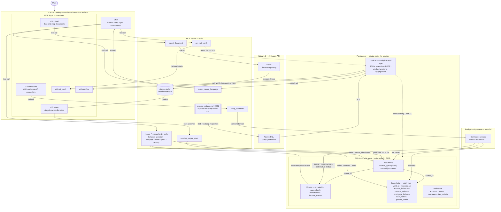

# Architecture — Personal Finance App

**Status:** Design-complete, pre-implementation. Governs Stage 3 POC and all subsequent stages.

---

## What this is

A local-first, AI-native personal finance app for a single user (UK tax context). Three capabilities:

1. **Net worth** — accounts, assets, mortgages, pensions; point-in-time and trended.
2. **Cashflow and budgeting** — PAYE, NI, pension contributions, ISA allowances.
3. **Insight and Q&A** — natural language queries answered from real data.

**The app is a local stdio MCP server.** Claude Desktop is the harness — it provides chat, tool orchestration, and renders interactive UI resources (`ui://`) in sandboxed iframes via the MCP Apps extension. No web server. No public exposure. All data stays on disk.

---

## Interaction model

**Claude Desktop is the exclusive user interface.** The user never interacts with the MCP server directly, never edits a config file to add a connector, and never runs a CLI tool. Every interaction — uploading a document, adding an API key, entering a value manually, asking a question — flows through Claude Desktop.

Three modes:

**Conversation (chat)** — The default mode. The user types in Claude Desktop's chat interface. Claude invokes tools directly from the conversation: "My pension pot is £42,000 as of today's statement" calls `ingest_manual_entry`. "What's my net worth?" calls `query_natural_language`. No form required.

**UI resources** — For interactions that benefit from dedicated UI. Rendered as sandboxed iframes via MCP Apps:

| Resource | Purpose |
|---|---|
| `ui://upload` | Drag and drop documents (PDFs, screenshots). Displays ingestion queue and parse progress. |
| `ui://connectors` | Add, configure, and disable API connectors. Handles OAuth flows and API key entry. |
| `ui://review` | Confirm or reject rows staged from document parsing before they write to the store. |
| `ui://net_worth` | Net worth dashboard — trended, point-in-time. |
| `ui://cashflow` | Cashflow and budget dashboard. |

**Background processes** — Connector runners (Monzo, Ethereum wallet) run as launchd daemons independent of Claude Desktop. Their *setup* — credentials, schedule, enable/disable — happens through `ui://connectors`. Once configured they run autonomously, writing to SQLite directly. The user never touches them again unless reconfiguring.

---

## Tech stack

| Component | Technology | Why |
|---|---|---|
| MCP server | Node.js + `@modelcontextprotocol/sdk` | Matches the ext-apps reference implementation; stdio transport; no extra process |
| Write store | SQLite via `better-sqlite3` | Local-first, ACID, single file, zero ops. The only sensible choice. |
| Analytical read | DuckDB via `duckdb` npm + SQLite extension | Reads the `.sqlite` file directly — no ETL, no sync. Columnar execution for window functions and complex joins. |
| Document parsing | Haiku 4.5 (vision) | Fast, cheap, accurate enough on payslips and statements at ~£0.005–0.01/page. |
| Natural language queries | Haiku 4.5 (text-to-SQL) | Generates SQL from natural language against schema catalog + DDL. DuckDB executes it. |
| UI resources | MCP Apps (`ui://` resources) | Rendered in Claude Desktop's sandboxed iframe. No separate frontend. |
| Background connectors | Separate OS process (launchd on Mac) | MCP server lifecycle is bound to Claude Desktop. Periodic API syncs must run independently. |

---

## Architecture diagram



---

## Persistence layer

### Two table patterns

Every table is one of two patterns. Mixing them is a design error.

#### Event tables — immutable, append-only

Things that happened. Never updated. Never deleted.

```sql
occurred_at        TIMESTAMP NOT NULL
recorded_at        TIMESTAMP NOT NULL
source_id          INTEGER NOT NULL REFERENCES documents(id)
external_id        TEXT
```

#### Snapshot tables — temporal observations

Observed values that change over time. Gaps filled at query time via LOCF.

```sql
valid_from         DATE NOT NULL
valid_to           DATE
recorded_at        TIMESTAMP NOT NULL
source_id          INTEGER NOT NULL REFERENCES documents(id)
```

Corrections close the old row (`valid_to = today`) and insert a new one with the corrected value. The old row is preserved — the full history is always recoverable.

#### Flex layer — optional `payload` column

Some tables carry a long tail of attributes that vary per source and resist typing. These get a nullable `payload` JSON column (stored as JSON text, readable by DuckDB) for the unmodelled remainder. The payload is an optional column orthogonal to the event/snapshot/reference patterns — it is not a third pattern. It is added to a table only when that table has a demonstrated long tail, never as a blanket field. Its use is bounded by design rule 7.

### Table taxonomy

| Table | Pattern | What it holds |
|---|---|---|
| `documents` | Reference | Source anchor for every ingested row — file, manual JSON, connector run |
| `transactions` | Event | Every cash movement; linked to account |
| `income_events` | Event | Per-payslip: gross, net, PAYE, NI, pension contribution, employer contribution; variable line items in `payload` |
| `equity_vesting_event` | Event | A vesting tranche — vest date, units, estimated value; scheme-specific detail in `payload` |
| `account_balances` | Snapshot | Current account, savings balances at observation time |
| `pension_values` | Snapshot | Pot value at statement date |
| `mortgage_balance` | Snapshot | Outstanding balance, current interest rate, property value |
| `asset_values` | Snapshot | Crypto, investments — original currency + GBP equivalent at observation |
| `person_profile` | Snapshot | Salary, tax code, employer — valid_from/valid_to tracks changes |
| `accounts` | Reference | Account definitions (bank, type, ISA subtype, currency) |
| `assets` | Reference | Asset definitions (name, type, currency) |
| `mortgages` | Reference | Mortgage definitions (lender, property, original amount) |
| `equity_grant` | Reference | Equity award definition — scheme type, units, strike, vest schedule; variable terms in `payload` |
| `tax_periods` | Reference | UK tax years — `starts_on` (April 6), `ends_on` (April 5) |

### Design rules

These are invariants. They hold across all tables, all ingestion types, all stages.

1. **`source_id` is non-negotiable.** Every event and snapshot row carries a FK to `documents`. A row with no source is a schema violation, not a warning. Enforced as a `NOT NULL` constraint, not application logic.

2. **Amounts are integers, currency is explicit.** `amount_pence INTEGER NOT NULL`. Never `REAL`. Every monetary column specifies its unit in the name. Every table with monetary data has `currency TEXT NOT NULL DEFAULT 'GBP'`. Multi-currency assets store both `original_amount`, `original_currency`, and `gbp_equivalent_pence` at observation time — never rely on a live FX rate at query time.

3. **UK tax year is explicit.** The `tax_periods` table is the single source of truth for April 6 → April 5 boundaries. All ISA and PAYE queries anchor to this table. The schema catalog documents this so Haiku never assumes calendar year.

4. **Snapshot staleness is always surfaced.** Every query over snapshot data returns `recorded_at` alongside the value. The UI displays it. "Your pension is £42,000" without a date is a misleading statement.

5. **LOCF is a query contract.** The last known value for a snapshot is always returned for any query date, via `LAST_VALUE ... IGNORE NULLS` window functions in DuckDB. The application never interpolates or estimates. Unknown = last observed.

6. **`external_id` on event rows.** Required for connector-ingested events. Inserts from connectors use `INSERT OR IGNORE` — deduplication is guaranteed at the database level, not application logic.

7. **The flex layer is bounded.** A nullable `payload` JSON column holds the long tail of attributes that vary per source and resist typing. It is governed strictly:
   - Anything aggregated or trended stays in the typed spine — money, dates, currency, counts are never in `payload`. The payload holds descriptive attributes reasoned over qualitatively, never arithmetic.
   - Provenance never moves into `payload`. `source_id`, `recorded_at`, `valid_from` stay typed.
   - The payload is not a primary text-to-SQL target. The schema catalog documents that a table has a payload and what kind of thing it holds — it does not expose payload keys for querying. Payload surfaces in the UI and Claude's reasoning layer.
   - Promotion path: a payload attribute that becomes a recurring query target graduates to a typed spine column. This keeps the spine honest and the catalog bounded.
   - Payload is parser-structured output (typed primitives extracted first, remainder to payload), not free-form user input.
   - Added per table only on demonstrated need. Initially: `income_events`, `equity_grant`, `equity_vesting_event`. Pure-value tables (`account_balances`, `pension_values`, `mortgage_balance`) stay spine-only.

---

## Ingestion pipeline

Three source types. The table taxonomy is identical for all three. The pipeline differs.

### Upload (low trust)

PDF, screenshot, or any document the user drops.

```
Upload → ingest_document tool → Haiku vision → extracted rows → staging buffer
→ ui://review (user confirms) → confirm_staged_rows tool → write to SQLite
```

- `documents.source_type = 'upload'`
- Human confirmation is **mandatory**. Haiku can misparse. The staging/review step is non-negotiable.
- The `documents` row stores the file path, content hash, and ingestion timestamp.

### Manual entry (medium trust)

Values the user types directly into chat. Manual entry is fanned out across one tool per series rather than a single dispatching tool — the LLM picks the right one from the conversation. Each tool ensures its reference row (account/asset/mortgage/grant), writes the audit JSON document, and writes the typed snapshot or event row in one transaction.

| Tool | Writes to |
|---|---|
| `record_account_balance` | `account_balances` (creates `accounts` row if needed) |
| `record_pension_value` | `pension_values` (creates pension `accounts` row if needed) |
| `record_mortgage_balance` | `mortgage_balance` (creates `mortgages` row if needed) |
| `record_asset_value` | `asset_values` (creates `assets` row if needed) |
| `record_equity_grant` | `equity_grant` |
| `record_vesting_event` | `equity_vesting_event` (requires existing grant) |

```
Manual input → record_* tool → writeManualDocument generates JSON → write document row
→ ensure reference row → write event/snapshot row with source_id
```

- `documents.source_type = 'manual'`
- The JSON file captures the raw input exactly as entered — not the processed version. This is the audit trail.
- No staging/confirmation step needed. The user is the source.
- File lives in the same documents directory as uploads. Named `manual_YYYY-MM-DDTHH:MM:SS.json`.

### API connectors (high trust)

Monzo, Ethereum wallet, or any structured data source. **Runs as a background OS process (launchd), not inside the MCP server.**

```
Connector runner → API call → structured data → INSERT OR IGNORE (external_id dedup)
→ write event/snapshot rows → write connector run record to documents
```

- `documents.source_type = 'connector'`
- Auto-write, no confirmation step. Data is structured; confidence is high.
- `external_id` on every event row (Monzo transaction ID, ETH tx hash). Idempotent inserts.
- The MCP server is not involved in writes. It reads the results via DuckDB.
- Connector run record in `documents` includes: connector name, run timestamp, rows written, API response hash.

### The `documents` table as universal source anchor

All three ingestion types write to `documents` first. Every event and snapshot row has `source_id` pointing here.

```sql
CREATE TABLE documents (
  id           INTEGER PRIMARY KEY,
  source_type  TEXT NOT NULL CHECK (source_type IN ('upload', 'manual', 'connector')),
  file_path    TEXT NOT NULL,
  content_hash TEXT NOT NULL,
  ingested_at  TIMESTAMP NOT NULL DEFAULT CURRENT_TIMESTAMP,
  notes        TEXT
);
```

This table answers "where did this number come from?" for any row in the database.

---

## Query pipeline

```
User question → Claude Desktop chat → query_natural_language tool
→ schema_catalog.md + DDL → Haiku text-to-SQL → SQL → DuckDB (reads SQLite)
→ result set → tool response → Claude Desktop renders answer
```

### Schema catalog

`schema_catalog.md` is a first-class design artefact, maintained alongside the DDL. It contains:

- One entry per table: purpose, what a row represents, when rows are inserted vs closed
- One entry per non-obvious column: units, sign convention (negative = outflow), temporal semantics
- UK tax year semantics: ISA periods, PAYE year boundary, how to join `tax_periods`
- 5–10 example question/query pairs covering common use cases

This document is injected into every Haiku text-to-SQL call alongside the DDL. Schema naming and catalog quality are the primary levers for query accuracy — well-named schemas with clear catalogs reach ~95% accuracy on the kinds of questions this app handles. No fine-tuning needed.

### Query routing

Not all questions are SQL questions. The schema catalog documents which question types are SQL-answerable:

- **SQL-answerable:** "What was my biggest expense category last quarter?", "How much ISA allowance do I have left?", "What is my current LTV?"
- **Claude Desktop reasoning (not SQL):** "Am I on track for retirement?", "What would happen if I overpaid my mortgage by £500/month?", "Was I on the right tax code last year?" — these require domain logic (PAYE bands, actuarial projection) that lives in Claude's reasoning layer, not SQL. The tool returns raw data; Claude Desktop computes the answer.

---

## Use case validation

| Use case | Design fit | Notes |
|---|---|---|
| Net worth at a point in time + trend | ✅ | LOCF across snapshot series; DuckDB windowed aggregation |
| Cashflow by category | ✅ | Event table + DuckDB GROUP BY; requires categorisation at ingestion |
| PAYE / tax code correctness | ✅ data / ⚠️ logic | Raw payslip facts from `income_events`; PAYE arithmetic in Claude Desktop |
| Pension pot value + contribution history | ✅ | Snapshots + events on different cadences; pre-built view for growth calc |
| Mortgage balance, equity, LTV | ✅ | Two snapshot series joined at query date |
| ISA allowance (UK tax year) | ✅ | `tax_periods` table; SUM of deposits since `starts_on` |
| Salary history + correction | ✅ | `valid_from`/`valid_to` on `person_profile`; close + insert on correction |
| Late / backfill ingestion | ✅ | `valid_from` = statement date, `recorded_at` = today; retroactive correction by design |
| Historical correction without data loss | ✅ | Close old row, insert corrected row; old row preserved |
| LLM natural language query | ✅ | Schema catalog + DuckDB execution; schema naming is the accuracy lever |
| Crypto P&L | ✅ | `asset_values` snapshots + acquisition events; staleness must be surfaced |
| Progressive data entry (sparse early data) | ✅ | LOCF returns last known value; null = never tracked, distinguished from zero |
| Multi-currency assets | ✅ | Store original + GBP equivalent at observation; no live FX at query time |
| Connector deduplication | ✅ | `external_id` + `INSERT OR IGNORE`; idempotent by design |

---

## Decision log

| Date | Decision | Rationale |
|---|---|---|
| 2026-05-26 | Architecture: Claude Desktop + local stdio MCP server + MCP Apps | App is the MCP server. No web server, no OAuth, no public exposure. Data stays on disk. |
| 2026-05-26 | Ingestion: human review non-negotiable for document uploads | Haiku vision can misparse. Silent writes to canonical store are not acceptable. |
| 2026-05-26 | Recommendations: observations only | "ISA 60% funded, 47 days left." No buy/sell/overpay advice until trust is established. |
| 2026-05-26 | Write store: SQLite via `better-sqlite3` | Local-first, ACID, single file, zero ops. |
| 2026-05-26 | Read layer: DuckDB via SQLite extension | One file, two engines. No ETL. Columnar reads for LOCF and aggregations. |
| 2026-05-26 | Amounts: integers (pence), never floats | Financial correctness. Rounding errors in floats are unacceptable for tax calculations. |
| 2026-05-26 | UK tax year: explicit `tax_periods` table | All ISA/PAYE queries anchor here. Haiku must never assume calendar year. |
| 2026-05-26 | Source anchor: `documents` table, universal | All ingested rows (upload, manual, connector) carry `source_id`. No orphaned data. |
| 2026-05-26 | Manual entry: system-generated JSON acts as document | No schema change needed. Uniform audit trail across all ingestion types. |
| 2026-05-26 | Connectors: separate OS process (launchd) | MCP server lifecycle is bound to Claude Desktop. Periodic syncs must run independently. |
| 2026-05-26 | Connector deduplication: `external_id` + `INSERT OR IGNORE` | Idempotent at the database level. No application-layer dedup logic. |
| 2026-05-26 | Text-to-SQL accuracy: schema design + catalog, not fine-tuning | Well-named schemas + `schema_catalog.md` reach ~95% accuracy on bounded domains. |
| 2026-05-26 | Staleness: always surface `recorded_at` | Every snapshot-derived value carries its observation date. Never imply live data. |
| 2026-05-27 | Flex layer: bounded `payload` JSON on proven-tail tables | Typed spine for anything aggregated or trended; `payload` for the unmodelled long tail on `income_events` and the equity tables. Not blanket, not a query target, with a promotion path. Derived from the end-state flow refinement in `docs/end-state-flows.md`. See design rule 7. |
| 2026-05-27 | Equity entities: `equity_grant` + `equity_vesting_event` | Typed primitives (scheme type, units, strike, vest dates) plus `payload` for scheme-specific terms. Valuation and vesting-tax methods remain open decisions. |
| 2026-05-28 | Manual entry: fanned per series, not a single dispatching tool | Six `record_*` tools (`account_balance`, `pension_value`, `mortgage_balance`, `asset_value`, `equity_grant`, `vesting_event`). Each owns its own zod schema, ensures its reference row, writes the audit JSON, and inserts the typed row in one transaction. The LLM picks the right one from chat. Shared helpers in `references.ts`. |
| 2026-05-28 | Net worth: dedicated `get_net_worth` tool, not text-to-SQL | Contingent (unvested) equity valuation isn't expressible as a single clean query and must not be confused with realised holdings. A typed module computes the split and is consumed by `ui://pfa/net_worth.html`. |
